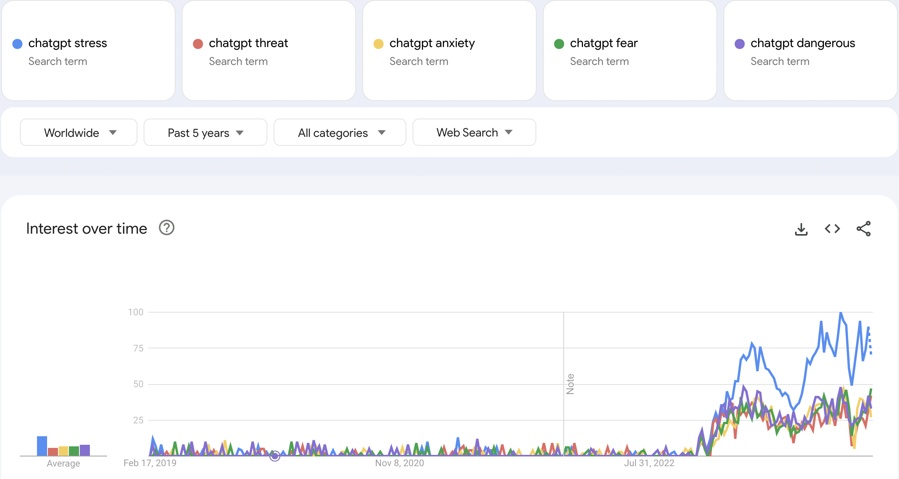
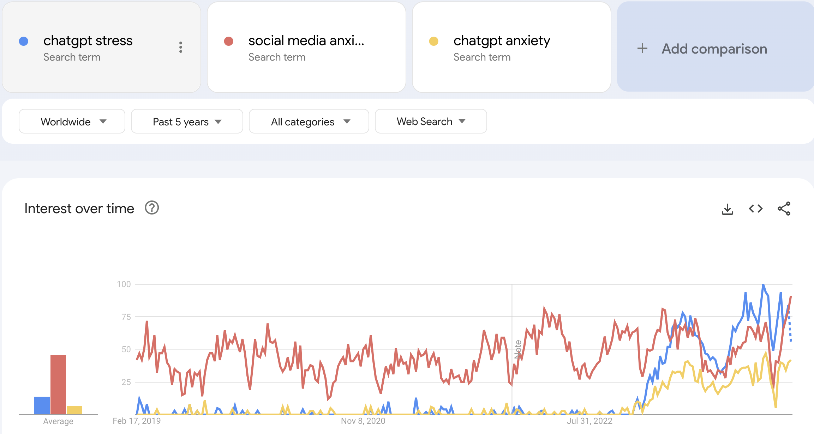

# Google Trends Data on ChatGPT Risks

Two Google Trends datasets provide insights into public interest and concerns regarding ChatGPT and social media, as reflected in Google search queries globally. 
The first dataset focuses on various negative perceptions associated with ChatGPT, while the second dataset offers a comparison between concerns related to ChatGPT and those related to social media.

## Datasets Overview

### 1. Google Trends on ChatGPT (google_trends_chatgpt_5.csv)
This dataset captures the worldwide Google search queries related to ChatGPT and associated terms like stress, threat, anxiety, fear, and dangerous from February 2019 onwards.

### 2. ChatGPT vs. Social Media Concerns (google_trends_chatgpt_vs_soc_media.csv)
This dataset offers a comparative view of the global search interest in "chatgpt stress" and "chatgpt anxiety" against "social media anxiety," highlighting the public's perception and concerns over time.

## Analysis

⚠️ More detailed information and analysis in [analysis](../3_data_analysis/google_trends)

### Insights from the Datasets

The analysis of these datasets sheds light on the evolving landscape of public interest and concern regarding digital technologies. The marked increase in ChatGPT-related queries from its inception to a point where they rival or exceed those related to social media anxiety underscores a significant shift in societal focus. This trend suggests a new dimension of interest that could influence future research, policy-making, and public discourse around AI technologies. It highlights the need for a deeper understanding of how AI, like ChatGPT, impacts mental health, privacy, security, and societal norms. As AI technologies become more integrated into daily life, monitoring and analyzing these trends will be crucial for anticipating and mitigating potential negative impacts on society.