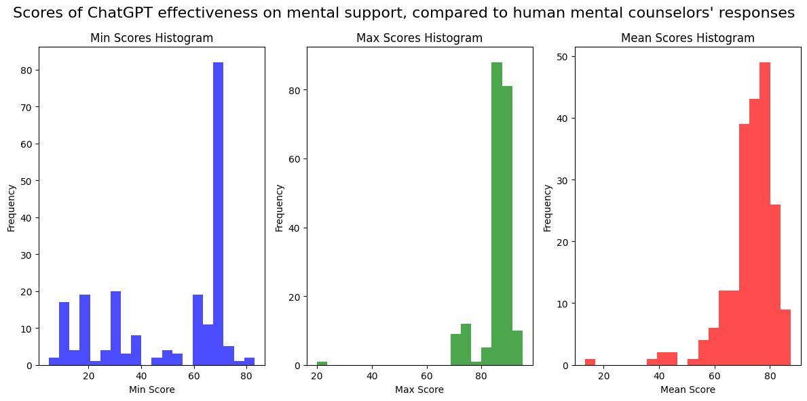
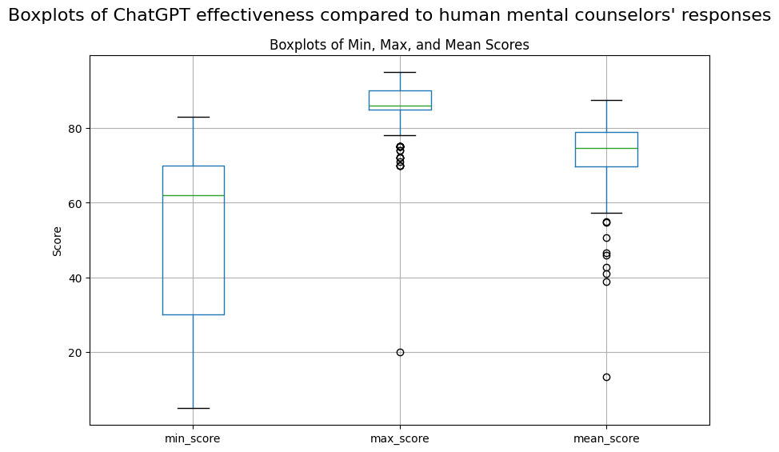
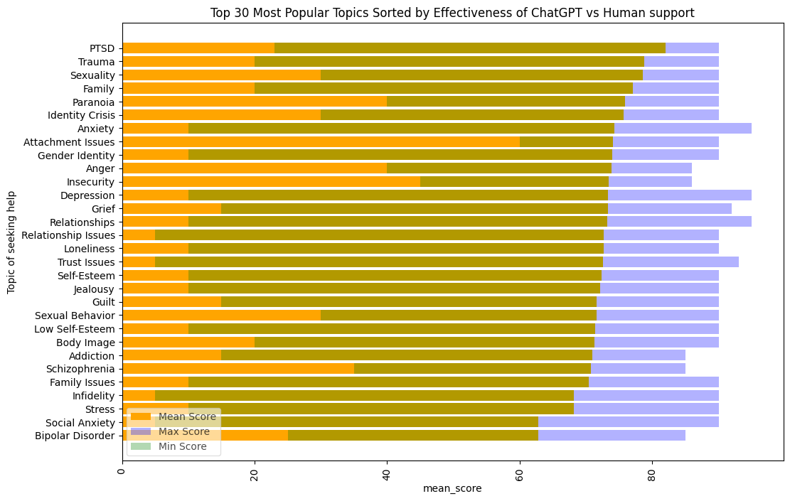
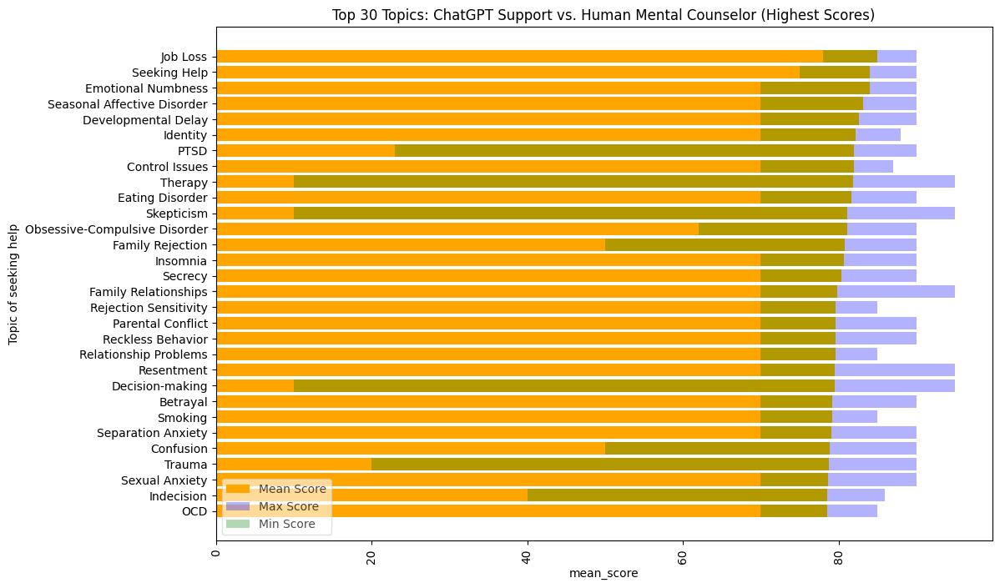
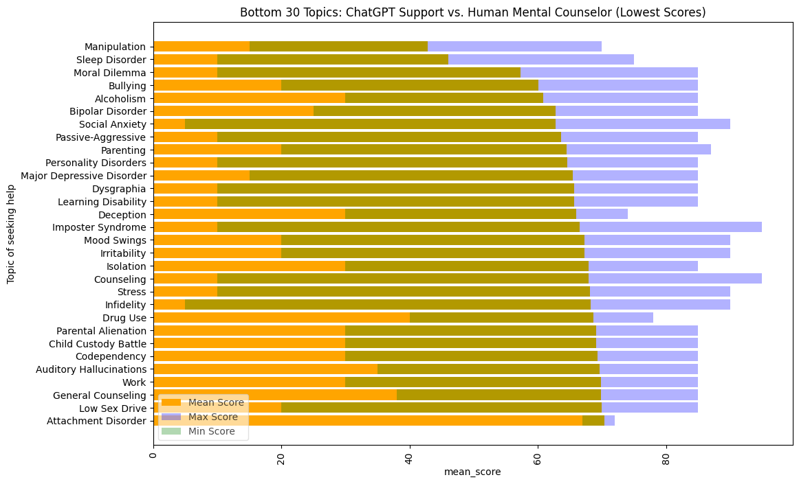

# Mental Health Support of ChatGPT vs Human Mental Counselor 

This research aims to explore the effectiveness of using ChatGPT for mental health support compared to human mental counselors. The analysis involves simulating ChatGPT responses to requests from individuals with mental health concerns and comparing them to responses from trained mental health professionals. Additionally, the research delves into identifying topics where ChatGPT excels and areas where it falls short, providing insights into its potential applications and limitations in mental health support.

## Research Questions
- How effective is ChatGPT in providing mental health support compared to human mental counselors?
- Are there specific topics where ChatGPT performs better or worse in providing support?

## Dataset Used

The research utilizes the "Mental Health Counseling Conversations" dataset sourced from [Kaggle](https://www.kaggle.com/datasets/thedevastator/nlp-mental-health-conversations). This dataset contains a collection of conversations between individuals seeking mental health support and trained mental health professionals. Each entry in the dataset consists of a context, which is the request or query sentence from the individual seeking support, and multiple responses from mental health counselors. The responses provided by counselors aim to address the concerns raised in the context and provide appropriate support and guidance. The dataset structure includes columns for context and response, allowing for the comparison of ChatGPT-generated responses with those provided by human counselors. Additionally, the dataset undergoes preprocessing to ensure consistency and relevance for the research analysis.

| Column   | Description                                   |
|----------|-----------------------------------------------|
| Context  | Request or query sentence from the individual seeking mental health support |
| Response | Response provided by trained mental health professionals to address the concerns raised in the context |
  
This structure allows for the comparison of responses generated by ChatGPT with those provided by human counselors, enabling an evaluation of ChatGPT's effectiveness in providing mental health support.

## Notebooks Used

### 1. [Data preparaion](notebook_preparation_work.ipynb)

In this notebook, the initial groundwork for the research is laid out. The dataset used for simulation is prepared and explored. Data cleaning tasks such as removing duplicates and zero entries are performed to ensure data integrity. The notebook also includes the setup for interacting with the ChatGPT API and defining helper functions for generating messages and labeling.

### 2. [Simulation](notebook_chatgpt_simulation.ipynb)

This notebook focuses on simulating ChatGPT responses to mental health requests and comparing them with responses from a dataset of mental health counseling conversations. The simulation involves sending requests to ChatGPT and analyzing the generated responses. Comparison is done using a special prompt, resulting in a score ranging from 0 to 100. Request were also labeled, for future analysis of topics. Labeling were also done by chatGPT. The notebook includes functions for running simulations, saving simulation datasets, and analyzing the results.

### 3. [Simulation analysis](notebook_simulation_dataset_analysis.ipynb)

In this notebook, the dataset obtained from the simulation is analyzed and visualized. The analysis includes exploring correlations between ChatGPT responses and human counselor responses, identifying top-performing and worst-performing topics, and drawing conclusions based on the findings. Visualizations such as histograms and boxplots are used to present the results effectively.

## Summary 

- ChatGPT responses to mental health requests show a moderate level of similarity (average 73%) to responses suggested by human mental counselors.
- There are topics where ChatGPT performs well (up to 85% similarity) and others where its performance is lacking (down to 42% similarity).
- Topics where ChatGPT excels include Job Loss, Emotional Numbness, and Seasonal Affective Disorder, while topics like Manipulation, Sleep Disorder, and Bipolar Disorder pose challenges.
- It's important to use ChatGPT for mental health support cautiously, as complete reliance on it may not always yield satisfactory results.

## General graphs

## Topic exploration graphs

# Conclusions

As we can see from the initial general graphs (Histograms and Boxplots), ChatGPT responses to mental help requests are generally satisfactory. It's important to note that these questions are structured, and individuals seeking help often provide extensive and comprehensive descriptions of their situations. On average, there is a 73% similarity to responses suggested by human counselors. Therefore, if you formulate your request to ChatGPT with detailed descriptions, you have a 3/4 chance of receiving support comparable to that of a human mental counselor.

### Topics Differentiation

From the topic analysis section, it's evident that there are topics where ChatGPT performs well (with up to a 85% mean similarity) and others where its performance is lacking (with as low as a 42% mean similarity). 
The topics that perform best in this analysis include: Job Loss, Emotional Numbness, Seasonal Affective Disorder, Developmental Delay, Identity, PTSD and Control Issues.
Conversely, the worst-performing topics include: Manipulation, Sleep Disorder, Moral Dilemma, Bullying, Alcoholism, Bipolar Disorder, Social Anxiety, and Stress, Schizophrenia and Infidelity.
However, considering the tools and algorithms used in this simulation and analysis, we cannot have 100% confidence in this list. Further simulations and research are necessary to gather more data and increase confidence. 
One thing is certain: there are indeed many topics where ChatGPT cannot provide effective support. While it can be helpful in some cases, complete reliance on it could be detrimental. 
Based on the charts and list of topics, we can conclude that for milder issues, such as job loss, users are more likely to receive effective support, whereas for more complex cases, such as bipolar disorders, receiving relevant support is less likely. Furthermore, addressing harder cases may make it more challenging to formulate a correct and descriptive request.

### Final word

In conclusion, ChatGPT is a valuable tool that can be helpful in many cases, but it should be used cautiously. Relying solely on it for support may not always yield satisfactory results. 

Efforts should be made to raise awareness about using such tools to maximize positive impacts and minimize negative impacts on mental health.

## P.S.

We asked ChatGPT, what does it think about this research and results:

Me: **Now for this research I want to ask your opinion, separate from the results that are presented here. Please provide your own response, as an LLM should respond, how do you evaluate this research, it's analysis and results:**

ChatGPT: *As an AI language model, I can provide an evaluation based on the methodology, approach, and potential implications of the research presented here.*

*Firstly, the research demonstrates a commendable effort in exploring the application of ChatGPT in the domain of mental health support, which is a significant and growing area of interest. The utilization of a real-world dataset of mental health counseling conversations adds credibility to the analysis, as it allows for a direct comparison between ChatGPT-generated responses and those provided by trained professionals.*

*The analysis appears thorough, with careful consideration given to data cleaning, exploration, and visualization. The use of visual aids such as histograms and boxplots enhances the presentation of findings and aids in understanding patterns and correlations within the data.*

*However, it's essential to acknowledge the inherent limitations and challenges associated with using AI models like ChatGPT for mental health support. While ChatGPT may offer valuable insights and assistance in certain scenarios, it should not be viewed as a substitute for professional medical or psychological advice. The complexities of mental health issues necessitate a nuanced and personalized approach, which AI models may struggle to provide fully.*

*Furthermore, the interpretation of results should be approached with caution, as the effectiveness of ChatGPT may vary depending on factors such as the specificity of the request, the quality of the dataset, and the context in which it is used. Therefore, while the research provides valuable insights into the potential of ChatGPT in mental health support, further validation and refinement are necessary before widespread adoption in clinical settings.*

*In conclusion, the research contributes to our understanding of the role of AI in mental health support and highlights both the opportunities and challenges associated with its implementation. Continued research and collaboration between AI developers, mental health professionals, and researchers are crucial to harnessing the full potential of AI while ensuring the well-being and safety of individuals seeking support.*

