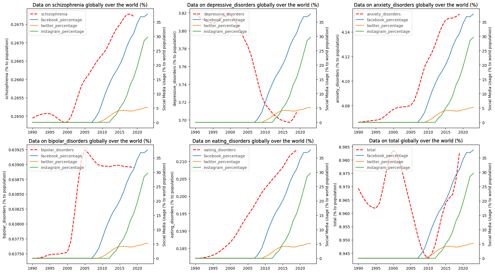
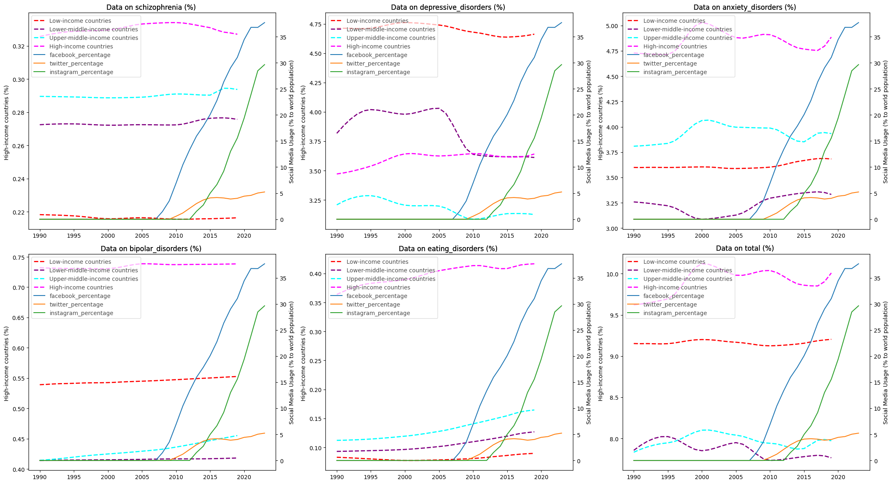
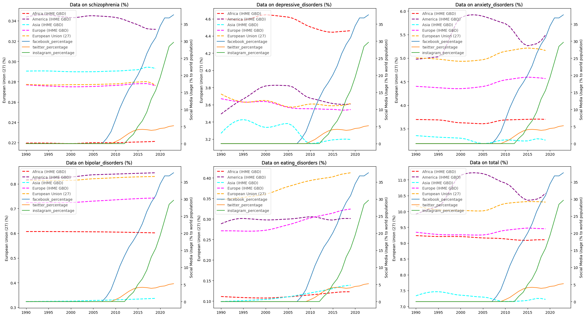

# Global Trends in Mental Health and Social Media Usage

In this research data analysis on the intersection of mental health trends and social media usage was conducted. The analysis is based on a dataset sourced from [Kaggle](https://www.kaggle.com/datasets/imtkaggleteam/mental-health?select=1-+mental-illnesses-prevalence.csv) regarding global trends in mental health, supplemented with data on social media usage from various platforms.

## Research Question
The primary aim of this analysis is to investigate the potential impact of social media and artificial intelligence (AI) on mental health. The research explores patterns and correlations within the dataset to discern any insights into how these factors might influence mental well-being.

## Data Sources
- [Global Trends in Mental Health Dataset](https://www.kaggle.com/datasets/imtkaggleteam/mental-health?select=1-+mental-illnesses-prevalence.csv): This dataset provides insights into the prevalence of mental illnesses across different countries and regions from 1990 to 2019. Dataset is in the ```kaggle2019``` folder.
- [Mental Health Depression Disorder Data](https://data.world/vizzup/mental-health-depression-disorder-data/workspace/file?filename=Mental+health+Depression+disorder+Data.xlsx): A supplementary dataset offering additional insights into mental health disorders, covering the period from 1990 to 2017. Dataset is in the ```dataworld2017``` folder.
- Social Media Usage Data: Data on monthly active users for platforms like [Facebook](https://www.businessofapps.com/data/facebook-statistics/), [Twitter](https://www.businessofapps.com/data/twitter-statistics/), and [Instagram](https://www.businessofapps.com/data/instagram-statistics/) have been collected to understand the relationship between social media engagement and mental health trends. Combined dataset is in the ```social_media_usage_by_years``` folder

## Jupyter notebook
All work with datasets and plot are made in ```Notebook_Global_Trends_Dataset_analysis.ipynb``` in this folder. 

Here is a brief description of the work done, resulting plots and conclusions.

## Data Cleaning and Exploration
The initial steps involve data cleaning and preprocessing to ensure consistency and usability across the datasets. Column names are standardized and irrelevant columns are removed for clarity and efficiency. A comparison with a similar dataset on mental health depression disorders is conducted to validate the integrity of the chosen dataset.

## Analysis Highlights
### Basic Analysis and Plots
- Basic analysis and plots are generated to understand the overall trends in mental health disorders over time.
- The dataset is segmented by countries and country groups to observe variations in mental health trends across different regions.
- Social media usage data is integrated into the analysis to explore potential correlations with mental health trends.

### Patterns and Correlations
- Patterns of correlation between mental health disorders and social media usage are explored.
- Analysis indicates changes in depression, anxiety, and schizophrenia over time, with some observable trends across different income levels and continents.
- While some correlations between social media usage and mental health disorders are observed, the complexity of mental health makes it challenging to draw definitive conclusions.

## Implications and Limitations
- The analysis suggests some patterns in mental health trends and their potential association with social media usage. However, it's important to note the limitations of the dataset and the complexity of factors influencing mental health.
- The findings underscore the need for further research and nuanced analysis to better understand the interplay between social media, AI, and mental health outcomes.


## Plots

### Correlation between mental health and social media usage globally 



### Correlation between mental health and social media usage by country groups by income level



### Correlation between mental health and social media usage by country groups by continents



## Conclusions

Looking at the chart, we can see no clear indications of a direct impact of social media on mental health, as was foreseen. Mental health is affected by many factors, and the rising usage of technology, computers, AI, and social media is one of them. However, we can see some patterns in certain types of disorders, starting from nearly the year 2000. We can say that using social media was one aspect of the increasing integration and reliance on technology and computers in daily life, and therefore relevant to our research question of AI's impact on mental health, since AI is a continuation of this line of technological evolution.

We should note that any patterns we may derive from the plots are not large in scale, and they change by points of percent. In plots for country groups, the differences are larger. We should also note that potential flaws in the given dataset should be taken into account.

## Patterns of correlation between mental health and social media usage

Let's see what patterns can be found on the global (worldwide) plots:
1. Decrease in depression from 2000 to 2015.
2. Increase in anxiety and schizophrenia from 2000.
3. Changes in other disorders do not seem correlated.

Let's see what patterns can be found on the plots for country groups based on income level:
1. Decrease in depression for low and low-middle-income countries from 2005, also a decrease for upper-middle-income countries around 2000, but with an increase afterwards.
2. Decrease in anxiety for high and upper-high-income countries, starting from 2000, but with an increase from 2015.
3. Increase in anxiety for low and lower-middle-income countries from 2000.
4. Changes in other disorders do not seem correlated.

Let's see what patterns can be found on the plots for continents:
1. America, Africa, and Asia (until 2010) show a decrease in depression from around 2002. Also, Europe, but with a small increase after 2010.
2. While America shows a decrease in anxiety from 2000 (with an increase from 2015), all other continents show a slight increase in anxiety from 2005.
3. America shows a decrease in schizophrenia, while Asia and Europe show a slight increase.
4. Changes in other disorders do not seem correlated.

## Summary

The variety of changes we observe shows some patterns. We may say they are not of huge value, considering factors such as potential flaws in the dataset and the general understanding that mental health is impacted by many factors. We will not be able to explore and analyze these factors to cancel them out for precise answers to this analysis. 

However, some patterns can be seen. For many country groups and continents, it seems that the use of social media indeed decreases depression by some amount. For high and middle-high-income countries, and for America, the use of social media seems to decrease anxiety, at least from 2000 to 2015. For other continents and for low and middle-low-income countries, anxiety seems to increase. Also, there seems to be some slight increase in other disorders like schizophrenia for some country groups. 

Eating disorders seem to have a general increasing trend and do not seem correlated. The total percentage of disorders for all groups and continents is too volatile and does not seem correlated.


This analysis may serve as a part of further exploration and discussion on our research question.