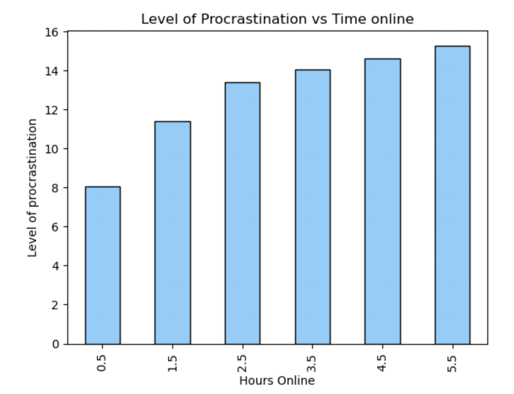
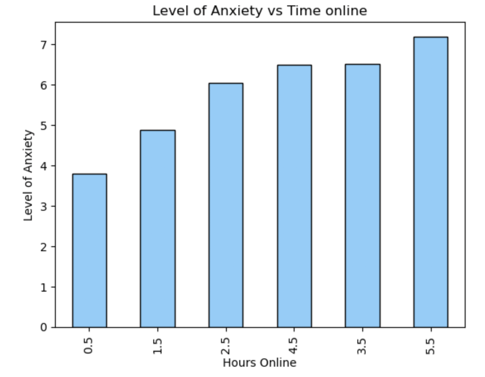
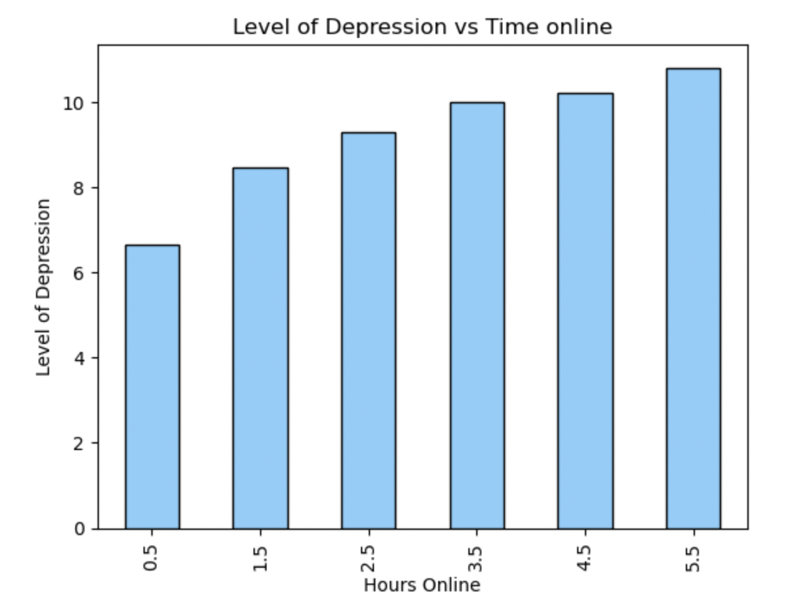
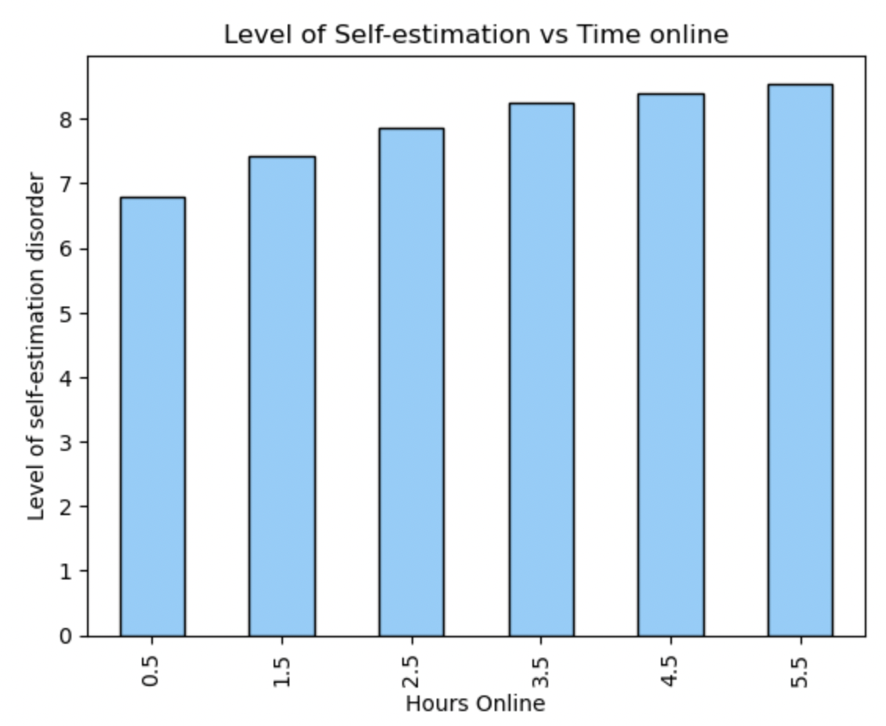
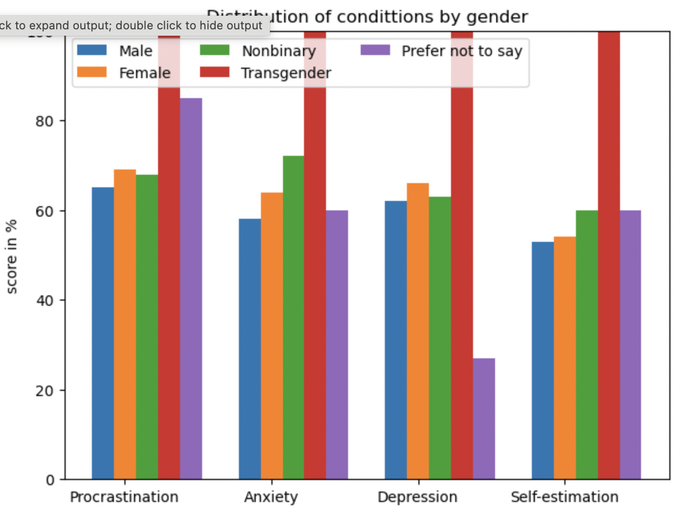
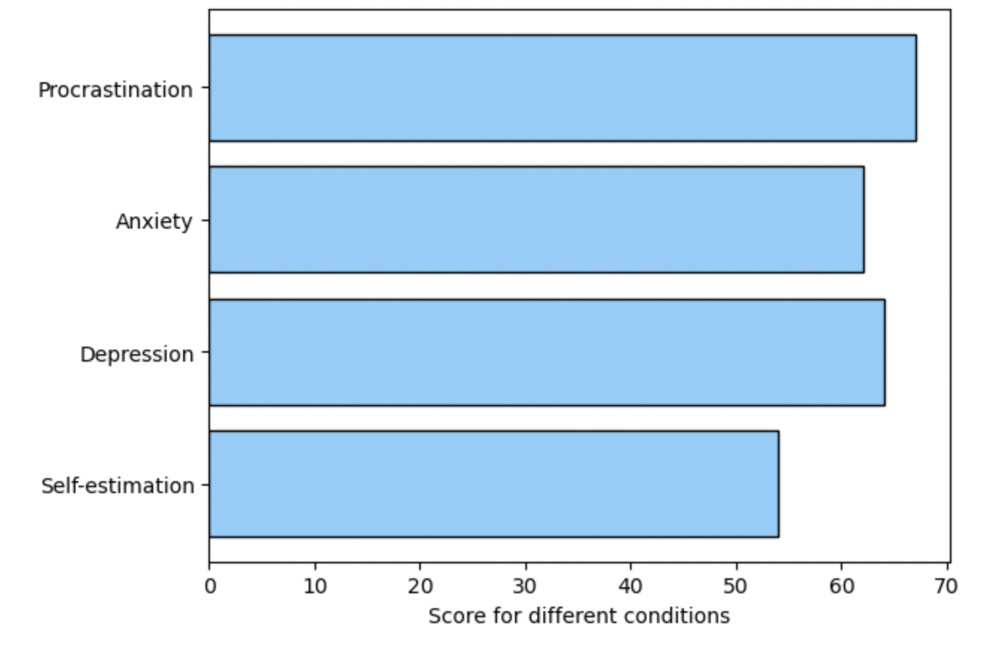

## Impact Social Media on Mental Health

## Dataset Source
For this part of project was used open dataset from 
[kaggle](https://www.kaggle.com/datasets/souvikahmed071/social-media-and-mental-health). 
This dataset was originally collected for a data science and machine learning project 
that aimed at investigating the potential correlation between the amount of time an 
individual spends on social media and the impact it has on their mental health.

##Data fields in original dataset before the data cleaning

| Field name                                                                                                       | Data type | Description                                           |
|------------------------------------------------------------------------------------------------------------------|-----------|-------------------------------------------------------|
| Timestamp                                                                                                        | object    | Date and time                                         |
| What is your age?                                                                                                | float64   | Age                                                   |                                                  |
| Gender                                                                                                           | object    | Gender identity                                       |
| Relationship Status                                                                                              | object    | Relationships                                         |
| Occupation Status                                                                                                | object    | Occupation                                            |
| What type of organizations are you affiliated with?                                                              | object    | Organization                                          |
| Do you use social media?                                                                                         | object    | Social media usage (yes/ no )                         |
| What social media platforms do you commonly use?                                                                 | object    | List of all SM that respondent use regularly          |
| What is the average time you spend on social media every day?                                                    | object    | Average time online everyday                          |
| How often do you find yourself using Social media without a specific purpose?                                    | int64     | Procrastination section of survey, score from 1  to 5 |
| How often do you get distracted by Social media when you are busy doing something?                               | int64     | Procrastination section of survey, score from 1  to 5 |
| Do you feel restless if you haven't used Social media in a while?                                                | int64     | Anxiety section of survey, score from 1 to 5          |
| On a scale of 1 to 5, how easily distracted are you?                                                             | int64     | Procrastination section of survey, score from 1  to 5 |
| On a scale of 1 to 5, how much are you bothered by worries?                                                      | int64     | Anxiety section of survey, score from 1 to 5          |
| Do you find it difficult to concentrate on things?                                                               | int64     | Procrastination section of survey, score from 1  to 5 |
| On a scale of 1-5, how often do you compare yourself to other successful people through the use of social media? | int64     | Self-estimation, score from 1 to 5                    |
| Following the previous question, how do you feel about these comparisons, generally speaking?                    | int64     | Self-estimation, score from 1 to 5                    |
| How often do you look to seek validation from features of social media?                                          | int64     | Self-estimation, score from 1 to 5                    |
| How often do you feel depressed or down?                                                                         | int64     | Depression section of survey, score from 1 to 5       |
| On a scale of 1 to 5, how frequently does your interest in daily activities fluctuate?                           | int64     | Depression section of survey, score from 1 to 5       |
| On a scale of 1 to 5, how often do you face issues regarding sleep?                                              | int64     | Depression section of survey, score from 1 to 5       |

The dataset contains 21 column and 474 rows with the answers of respondents for the survey. 

## Data cleaning
1. During the data cleaning some unnecessary columns were dropped. 
We don't need the data, organization name, and we understand that all respondents use Social Media platforms. 
2. All column names were changed to be shorter but still understandable.
3. Data types changing: 
 - 'Age' can not be float, so it was converted into integer. 
 - 'Hours online' was converted from the string into the integer using midpoint between two values.
4. SM Platforms column contained several values in one row 
(all social media that respondent uses). To clarify the information
the column was split on different columns for each platform and 
and was used 0 and 1 to mark if person uses particular SM platform or not.
5. Were created new columns with total score for each condition : Procrastination, 
Anxiety, Depression, and Self-estimation.

## Exploratory Data Analysis
Characteristics of respondents:
1. Gender:
- Female 55% of respondents
- Male 44 % of respondents
- Nonbinary 1%
- Transgender less than 1%
- Prefer not to say lass than 1%
2. Relationship status:
- Single 60%
- Married 20%
- In a relationship 19%
- Divorced 1%
3. Occupation:
- University student 61%
- Salaried worker 27%
- School student 10%
- Retired 2%
4. Age
- Main group of users is people from 20 to 30 years old. This group is 70%
- Group of 15-20 y.o is 9% of respondents
- Group of 40-50 y.o is 9% of respondents
- Group of 30-40 y.o is 7% of respondents
- Group of 50-60 y.o is 3% of respondents
- Groups 10-15 y.o. and 60-70 are 1% of respondents each

Analyze which platform people use the most was found next distribution:
- YouTube regularly use 85% of respondents
- Facebook 84%
- Instagram 74%
- Discord 41%
- Snapchat 38%
- Pinterest 30%
- Twitter 27%
- Reddit 26%
- TikTok 19%

Analyze time that respondent spend online every day was found that
- 24% of respondents spent online 5-6 hours every day
- 21% spend online 2-3 hours daily
- 19% spend online 3-4 hours daily
- 14% spend online 4-5 hours daily
- 15% spend online 1-2 hours daily
- 7% spend online less than hour

## Analise of connections between time spent online and level of severity for each condition

All plots show that symptoms for each condition increase with increasing time spent online. 

## Analise of distribution different conditions by gender 

Analyze shows some outliers in 'Transgender' and 'Prefer not to say (gender)'
groups, so we decided to check how many people in each of this gender group. 
We found that each group consist only one respondent, so this outliers statistically not significant. 

General plot for all conditions shows that respondents faced the most
with the Procrastination, then Depression, then Anxiety and have less impact on 
Self-estimation. 

## Correlation and Predictive analysis
 For all conditions - Procrastination, Anxiety, Depression,
 Self-estimation disorder - analysis showed that Gender is not significantly 
 important factor while time spent online increase the level 
 of symptoms. Built model predict that increasing Time online
 for 
 - 1.1 hour daily for Procrastination
 - 0.55 hour daily for Anxiety
 - 0.6 hour daily for Depression
 - 0.2 hour per day for Self-estimation 
add 1 point to level of symptoms by this particular survey.

| Condition       | Coefficient for 'Hours Online' | R-squared | MAE   | MSE     | RMSE    | Pearson r | p-value |
|-----------------|--------------------------------|-----------|-------|---------|---------|-----------|---------|
| Procrastination | 1.1                            | 0.187     | 2.812 | 12.467  | 3.530   | 0.4527    | 0.00995 |
| Anxiety         | 0.55                           | 0.227     | 1.611 | 3.561   | 1.887   | 0.4375    | 0.00995 |
| Depression      | 0.64                           | 0.114     | 2.435 | 8.857   | 2.976   | 0.341     | 0.00995 |
| Self-estimation | 0.18                           | 0.073     | 2.027 | 6.623   | 2.573   | 0.191     | 0.00995 |

At the same time, metrics for evaluation the performance of a
regression model show that we may have a big difference between
the predicted values and the actual values in the test set. 
Hours online explains no more than 22.7% of the variance in the condition's level.

## Conclusions
This survey shows that time people spent in social media may increase the level of symptoms for
Procrastination, Anxiety, Depression, Self-estimation. At the same time 
gender don't have any impact and all genders may risk of harmful effect of
Social Media if overuse them. 
The correlation coefficient is positive, suggesting a positive linear relationship
between the variables, but it's relatively weak. The p-value, which is 0.00995, 
represents the probability of observing a correlation coefficient as extreme as 
the one obtained (or more extreme) under the null hypothesis that there is no
correlation between the variables. A smaller p-value suggests stronger evidence 
against the null hypothesis. Here, the p-value is less than the conventional 
significance level of 0.05 (or 5%), indicating that the correlation observed is
statistically significant. Therefore, we reject the null hypothesis and conclude
that there is a statistically significant correlation between the variables.

## Utilizing the dataset
You find the csv file with the data in this folder. To effectively use this dataset, follow 
the provided analysis steps, adapting them based on your specific research goals.

